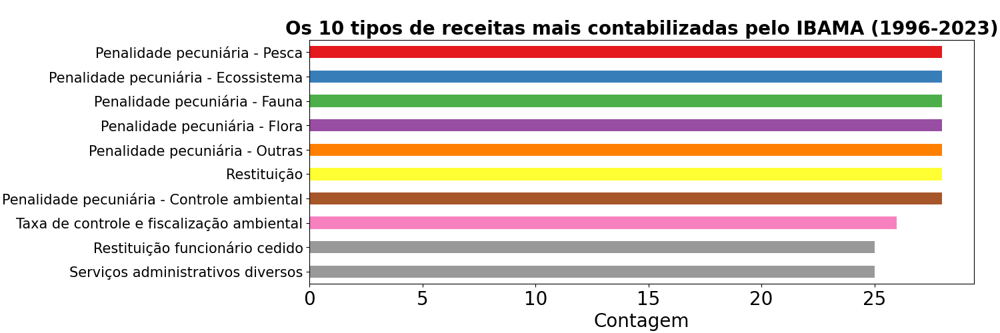
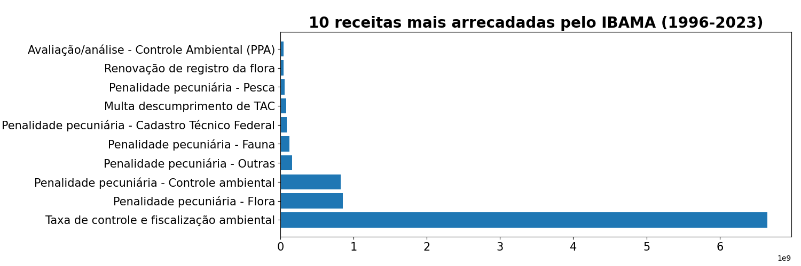
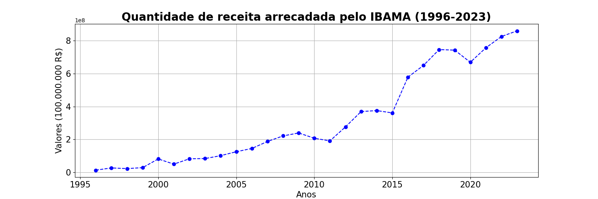
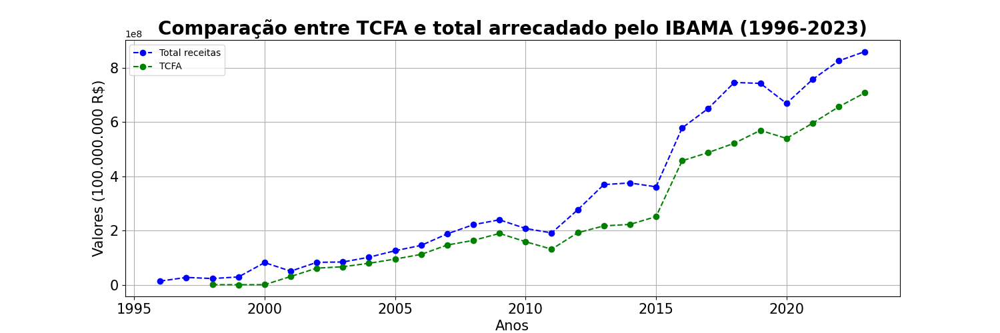
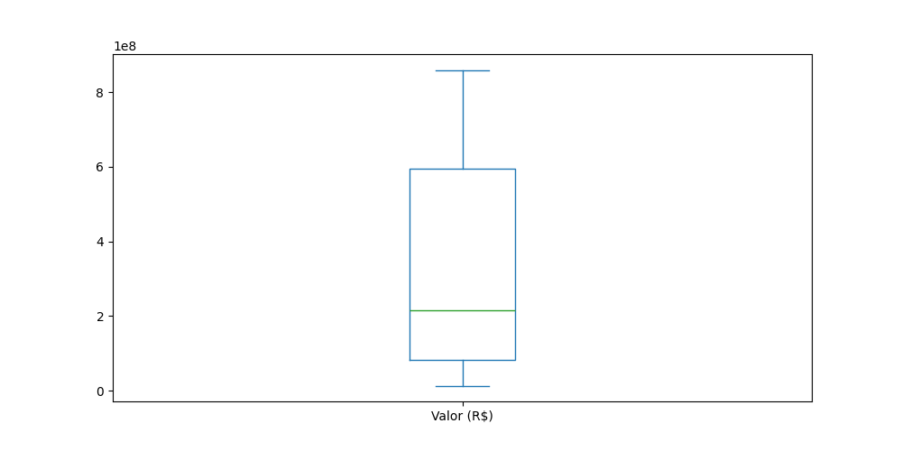

# Análise das receitas arrecadadas pelo IBAMA

## Introdução

As receitas, para qualquer tipo de empresa, orgão público ou privado, autarquias,
etc, são de suma importância para entender como está funcionando a gestão, se está havendo desperdício
de recursos, ou seja, são importantes indicativos para entender o <i>modus operandi</i>
daquele ente. E se tratando de IBAMA, uma autarquia federal vinculado ao ministério do meio ambiente,
ter noção de quais receitas arrecadadas é um bom indicativo para saber se ela
está fazendo aquilo para o objetivo que lhe foi designada, que é a preservação dos recursos naturais e
do meio ambiente. Para isso iremos analisar os dados disponíveis no próprio site do <a href='https://dados.gov.br/dados/conjuntos-dados/evolucao-das-receitas-arrecadadas'>IBAMA</a> para termos informações sobre essas receitas, que são de 1996 até 2023.

## Análise Geral

Com os dados dos registros, é perfeitamente possivel fazer uma análise deles, usando as ferramentas certas para tal trabalho. Para isso,utilizou-se a linguagem de programação <b>python</b>, juntamente com o ambiente virtual <b>jupyter notebook</b>, e as bibliotecas do python <b>pandas</b> e <b>matplotlib</b> para a manipulação dos dados e geração dos gráficos, respectivamente. Então veremos os resultados abaixo:

### Contagem total de receitas recebidas

Fonte: Arquivo pessoal (2023)
 

### Quantidade total de receitas arrecadadas

Fonte: Arquivo pessoal (2023)
 

### Evolução anual da soma total das receitas arrecadadas

Fonte: Arquivo pessoal (2023)
 

### Comparação entre a receita TCFA e total arrecadado

Fonte: Arquivo pessoal (2023)
 

### Gráfico de caixa da soma total anual das receitas

Fonte: Arquivo pessoal (2023)
 

## Conclusão

Percebe-se que, com uma simples análise dos dados e sua manipulação correta, é capaz de gerar gráficos a pontos de entender todo panorama geral de receitas arrecadadas feito pelo IBAMA, por exemplo. Sem contar que abre um leque de possibilidade para fazer análise mais aprofundadas ou procurar informações relevantes que ajude a elucidar algum tipo de problema. Para saber como eu fiz esses gráficos, basta acessar o <a href="https://github.com/engafs/evolucao_receitas_IBAMA/blob/master/arrecadacao_receitas_IBAMA.ipynb">notebook</a> presente nesse repositório. Já para entender toda uma análise completa a questão das receitas arrecadadas e as informações relevantes sobre esses dados do IBAMA, basta acessar meu <a href="https://medium.com/@aristotelesfernandes11/receitas-recebidas-pelo-ibama-uma-an%C3%A1lise-profunda-da-gest%C3%A3o-financeira-e-ambiental-7f6793856537">artigo</a> no medium.

